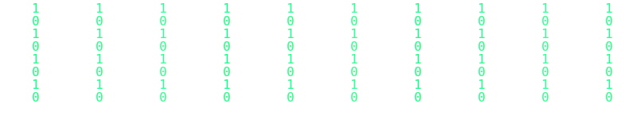

  

<!-- Typing effect with pixel font -->

  

<h1 align="center">👋 Hi, I'm Hichtoor</h1>

---

### 🧑‍💻 About Me
- 🔭 Currently working on: Myself
- 🌱 Currently learning: Python
- 💬 Ask me about: C++, HTML, CSS
- 📫 How to reach me: hichtoor@gmail.com
- 📱 Telegram: [@HICHT00R](https://t.me/HICHT00R)

---

### 🛠 Skills & Tools

  
  
  
  

---

### 📊 GitHub Stats

  
  

---

### 🌐 Social Links

  
  

---

  

💖 Made with love

